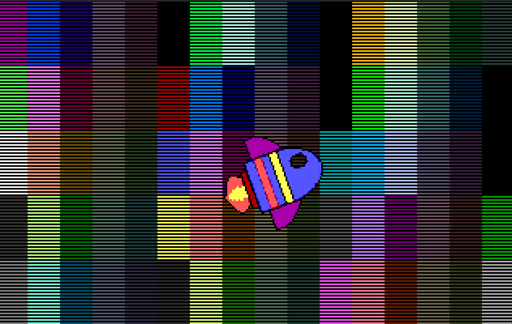

# dos-game-engine
Dos Game Engine project 

WIP, very early stage

# What does it do for now ?

Smoothly moves a spaceship over the screen with a background

# Notes
It uses Dos-dev
Clangd, cmake, djgpp, and Dosbox bundle extension for Visual Studio code  (search VS store)

# Features
- Game Loop
- Fast low level graphic screen copies and updates (no library)
- Smooth fast background scrolling on 386/486 with a vga
- Loading Bitmaps
- Mouse support
- VGA Mode 13, changing palletes
- Constant FPS in game loop regardless of CPU Mhz speed

# TODO

- Level screen graph
- Loading levels, objects
- Saving Load system
- Sound and Music
- Visual effects
- Extended memory support (with an extender)

# Why ?

I dont know i just feel like being nostaligic ;)
I was  kid playing dos games and the tech was magical and unknown to me
This is my way of rediscovering what 90s game engineers did
